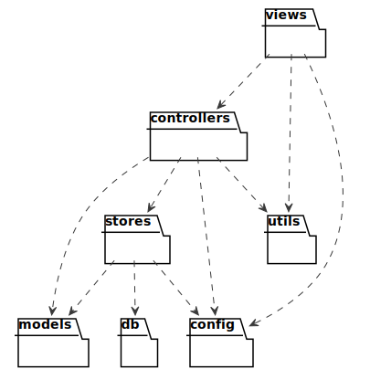
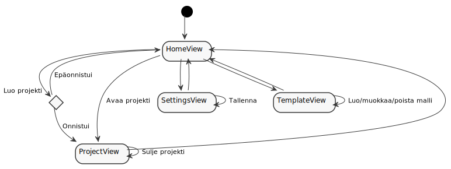
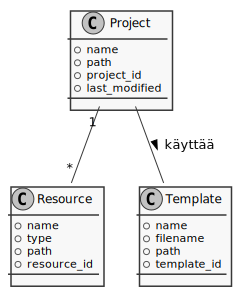
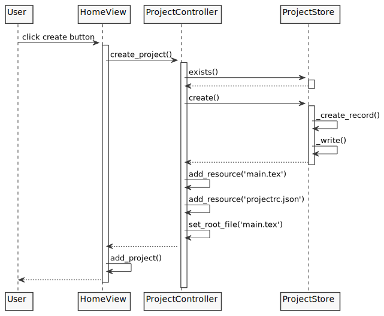
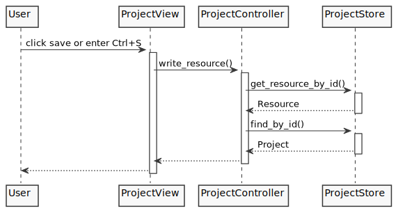
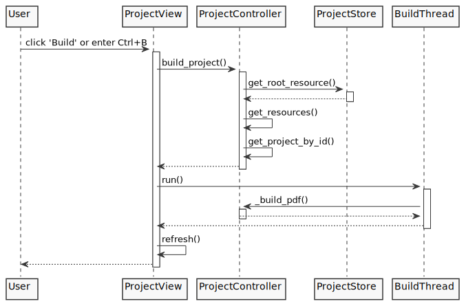

# Arkkitehtuuri

## Ohjelman rakenne

Ohjelma noudattaa MVCS-arkkitehtuuria, ja ohjelman keskeinen rakenne muodostuu pakkauksista, jotka riippuvat toistaan seuraavalla tavalla:



* Views: ohjelman käyttöliittymistä vastaavat luokat
* Controllers: ohjelman logiikasta vastaavat luokat
* Stores: ohjelman tallenuksesta vastaavat luokat
* Models: erilaisia ohjelman käyttämiä vastaavat mallit

## Käyttöliittymä

Ohjelman käyttöliittymä muodostuu seuraavista päänäkymistä:

* Juurinäkymä
* Kotinäkymä
* Projektinäkymä
* Asetusnäkymä
* Mallinäkymä

Juurinäkymä on näkyvissä aina. Sen vastuulla on toteuttaa navigaatio eri näkymien välillä sekä näyttää valittuna oleva näkymä. Juurinäkymässä voi olla näkyvissä vain yksi näkymä kerrallaan.

Käyttöliittymä on eriytetty sovelluslogiikasta täysin. _Views_-pakkauksen luokat käyttävät _controllers_-pakkauksen luokkien tarjoamia palveluita toimintojen toteuttamiseksi. Erityksetä johtuen ohjelmaan olisi helppoa toteuttaa uusi käyttöliittymä.

Navigointia sovelluksen eri näkymien välillä kuvaa seuraava kaavio:



## Sovelluslogiikka

Ohjelman mallien välisiä riippuvuuksia kuvaa seuraava kaavio:



## Data

Ohjelma tallentaa ja lukee dataa sekä tietokannasta että tiedostoista.

### Tiedostot

Ohjelman sekä projektien konfiguraatiot talletetaan tiedostoihin. Kaikki tiedostot ovat JSON-muodossa.

Ohjelman konfiguraatio on oletuksena ```config.json```-tiedostossa avain-arvopareina. Konfiguraatiotiedoston nimi ja polku on määritelty ```.env```-tiedostossa.

### Tietokanta

Tietokannassa on kaksi taulua: projektit (Projects) ja mallit (Templates). Tietokanta alustetaan ```init_db.sql```-tiedoston perusteella.

## Keskeiset toiminnallisuudet

### Projektin luominen



### Resurssin tallennus



### Projektin ajaminen

Kun projekti ajetaan, lähdekoodista luodaan pdf-tiedosto. Esikatselunäkymä päivittyy automaattisesti, kun tiedosto on luotu.

