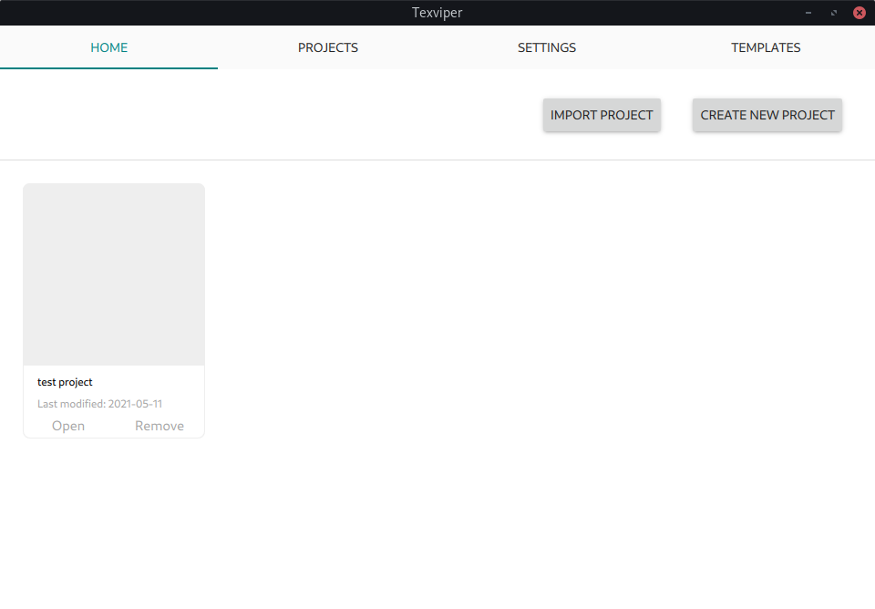
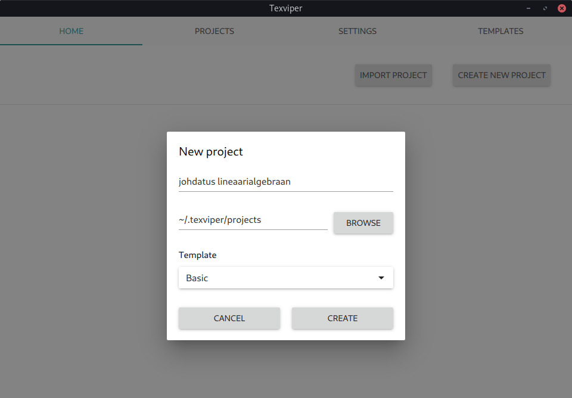
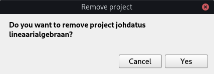
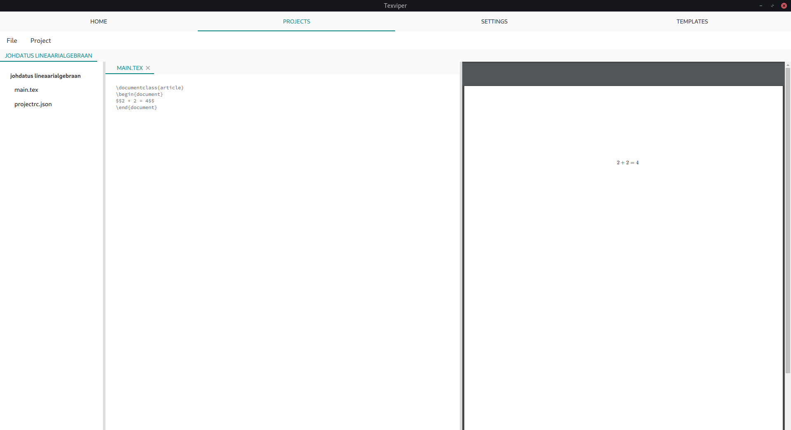
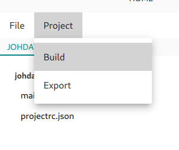
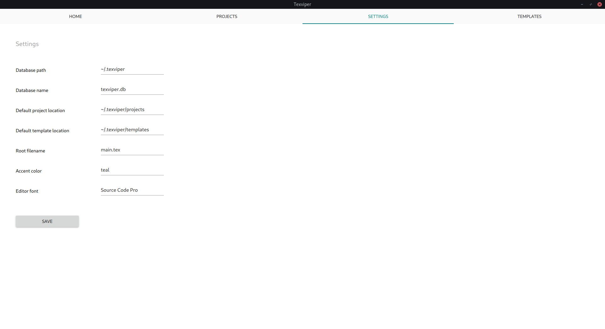
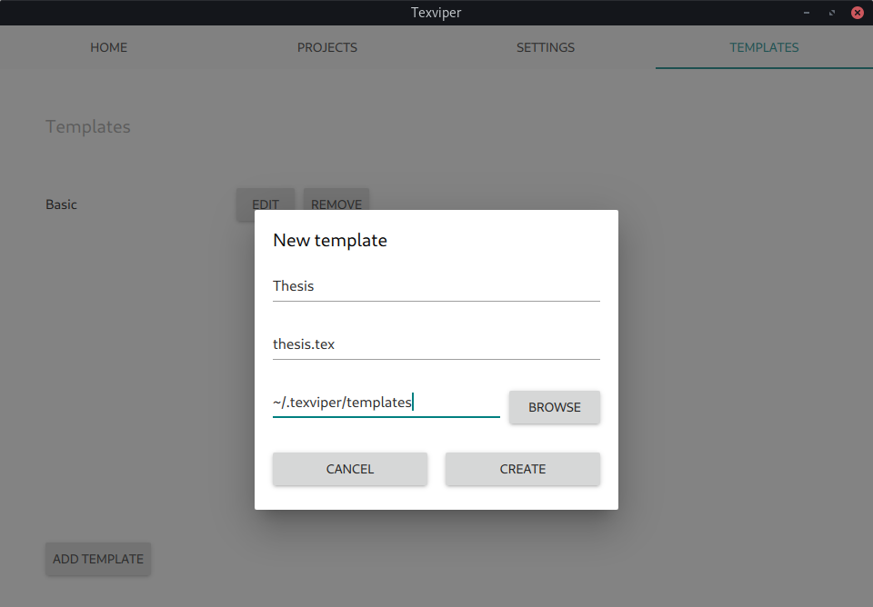
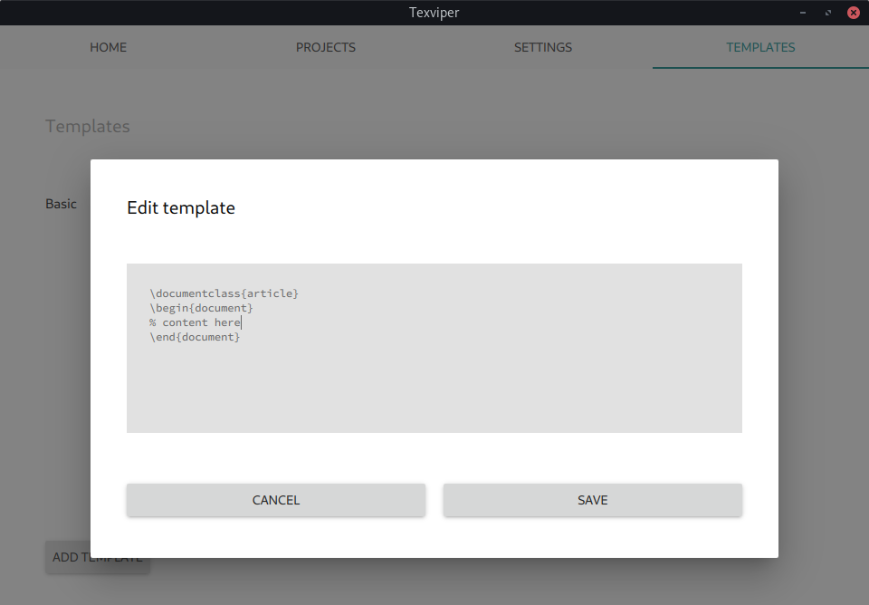

# Käyttöohje

Projektin viimeisin versio on ladattavissa viimeisimmän releasen _Assets_-osiosta.

## Konfiguraatio

Ohjelman konfiguraatio sijaitsee oletuksena ```config.json```-tiedostossa, joka sijaitsee oletuksena ```~/.texviper```-polussa. Mikäli konfiguraatiotiedostoa ei ole olemassa, se luodaan automaattisesti.

Konfiguraatiotiedoston oletusarvot on määritelty projektin juuressa sijaitsevassa ```.env```-tiedostossa.

## Käynnistys

Käynnistettäessä ohjelma se aukeaa kotinäkymään.



### Projektin luominen

Uuden projektin voi luoda painamalla _Create new project_-nappia. Tällöin avautuu näkymä, johon täytetään projektin nimi ja polku sekä mahdollisesti valitaan projektin alustuksessa käytettävä malli.



### Projektin poistaminen

Projektin voi poistaa painamalla _Remove_-painiketta. Ohjelma pyytää käyttäjältä varmistuksen ennen poistoa.



### Projektin avaaminen

Projektin voi avata painamalla _Open_-painiketta. Näkymä siirtyy automaattisesti projektinäkymään.

## Projektin muokkaus

Projektinäkymässä on kolme paneelia:

* Resurssipaneeli
* Muokkauspaneeli
* Esikatselupaneeli

Paneelien kokoa voi säätää raahamalla niiden välissä olevia kahvoja.



### Resurssien avaaminen

Resurssin voi avata tuplaklikkaamalla sen nimeä resurssipaneelissa.

### Resurssin luominen

Uuden resurssin voi luoda valitsemalla _File_-valikosta _Add resource_ ja syöttämällä resurssin nimen.

### Resurssin poistaminen

Resurssin voi poistaa projektista klikkaamalla sitä hiiren oikealla napilla ja valitsemalla avautuvasta valikosta _Remove_.

### Tallennus

Resurssin voi tallentaa joko valitsemalla _File_-valikosta _Save resource_ tai painamlla näppäinyhdistelmää Ctrl+S.

### Ajaminen

Projektin voi ajaa valitsemalla _Project_-valikosta _Build_ tai painamalla näppäinyhdistelmää Ctrl+B. Projektin esikatselunäkymä päivittyy automaattisesti pdf-tiedoston generoiduttua.



## Asetukset

Asetuksia voi muokata muokkaamalla suoraan arvoja. Tallennus tapahtuu _Save_-nappia painamalla.



## Mallit

Mallinäkymässä on listaus kaikista olemassaolevista malleista. Jokaisen mallin kohdalla on napit muokkaamiseen ja poistamiseen.


### Mallin luominen

Uusen mallin voi luoda painamalla _Add template_-nappia. Tällöin avautuu näkymä, johon täytetään mallin nimi, tiedostonimi ja polku.



### Mallin poistaminen

Mallin voi poistaa painamalla sen kohdalla olevaa _Remove_-nappia. Huomioi, että ohjelma ei pyydä käyttäjältä varmistusta mallia poistettaessa.

### Mallin muokkaaminen

Mallia voi muokata painamalla _Edit_-nappia. Tällöin avautuu muokkausnäkymä, jossa mallia voi muokata. Muutokset voi perua _Cancel_-nappia painamalla tai tallentaa _Create_-nappia painamalla.


