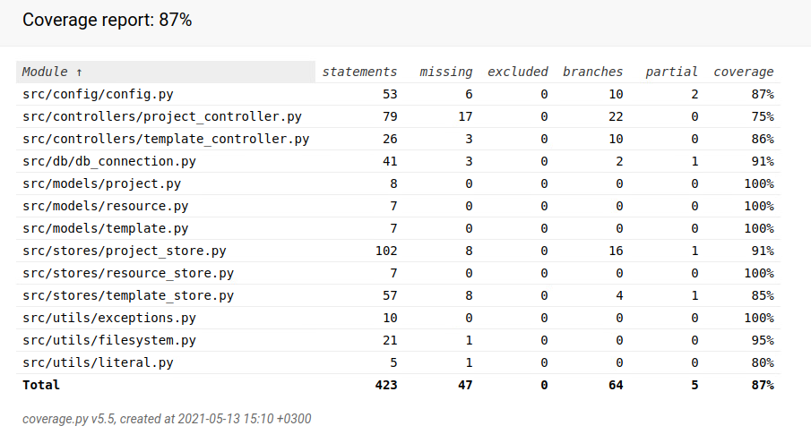

# Testausdokumentti

## Yksikkötestaus

Sovelluslogiikkaa on testattu sekä _store_- että _controller_-luokkien tasolla. Testauksessa on käytetty muistissa sijaitsevaa tietokantaa sekä _pyfakesfs_-kirjaston avulla luotua näennäistä tiedostojärjestelmää. Näin jokainen testi voidaan suorittaa eristetyssä ympäristössä ilman, että testit vaiktutavat toistensa toimintaan.

## Manuaalinen testaus

Ohjelmaa on testattu myös manuaalisesti käyttäen erilaisia reaalimaailman tapauksia. Ohjelmaa on testattu suorittamalla se tarvittavilla tiedostoilla, ilman tarvittavia tiedostoja sekä viallisilla tiedostoilla.

## Testikattavuus

Ohjelman testien haaraumakattavuus on 87%. Testeissä ei ole huomioitu käyttöliittymästä vastaavia luokkia (_views_).

