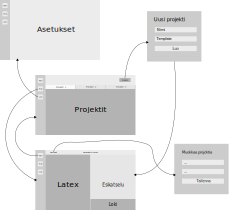

# Vaatimusmäärittely

## Käyttötarkoitus

Kyseessä on Latex-editori, jolla voidaan helposti luoda ja muokata Latex-dokumentteja. Sovelluksessa voi luoda projekteja, joissa dokumentteja voi muokata. Sovellus hallinnoi projektit tiedostojärjestelmässä käyttäjän puolesta, joten projekteja on helppo muokata ja ylläpitääm vaikka ne koostuisivat useista tiedostoista. Lisäksi sovellus mahdollistaa projektikohtaisten asetusten määrittelyn.

## Käyttäjäroolit

Sovelluksessa on yksi käyttäjärooli eli tavallinen käyttäjä. Käyttäjä hallinnoi sovellusta,
ja käyttäjällä on oikeus suorittaa kaikki sovelluksen mahdollistamat toiminnot. Erillistä ylläpitäjän roolia ei siis ainakaan tässä vaiheessa ole.

## Käyttöliittymä

Sovellus tarjoaa graafisen käyttöliittymän, joka muodostuu seuraavista näkymistä:

* Kotinäkymä: listaus olemassaolevista projekteista sekä uusien projektien luonti
* Projektinäkymä: aktiivisen projektin editori- ja esikatselupaneeli, muut avoimet projektit välilehtinä
* Asetukset: sovelluskohtaiset asetukset, kuten teema, templatet jne.

Sovellus mahdollistaa useamman projektin avaamisen välilehtiin. Lisäksi projektin sisällä voi olla välilehdissä useampia lähdekooditiedostoja.

Allaoleva kuva havainnollistaa karkeasti sovelluksen näkymiä ja navigaatiota niiden välillä.

## Toiminnallisuus

### Sovelluksen avauduttua

* käyttäjä voi luoda uuden projektin **[tehty]**
* käyttäjä voi tarkastella olemassaolevia projekteja **[tehty]**
* käyttäjä voi avata olemassaolevan projektin
* käyttjä voi poistaa olemassaolevan projektin **[tehty]**

### Projektin luominen

* projektin luomisen yhteydessä käyttäjä voi valita templaten, jota projektiin luodaan automaattisesti templaten määrittelemä oletustiedosto

### Projekti

* käyttäjä voi muokata Latex-lähdekoodia
* käyttäjä voi lisätä, uudelleennimetä tai poistaa Latex-lähdekooditiedostoja
* käyttäjä voi muokata projektin asetuksia
* käyttäjä voi lisätä ja poistaa projektista tiedostoja **[tehty]**
* käyttäjän muokatessa lähdekoodia sovellus päivittää esikatselunäkymän automaattisesti

### Sovellusasetukset

* käyttäjä voi luoda, muokata ja poistaa templateja joita käytetään uuden projektin alustuksessa **[tehty]**
* käyttäjä voi määrittää projektien oletustallennuspaikan **[tehty]**
* käyttäjä voi määrittää tietokannan sijainnin **[tehty]**

## Jatkokehitysmahdollisuuksia

* Paketinhallinta: käyttäjä voi ladata latex-paketteja sovelluksen kautta suoraan repositoryista ilman manuaalista asennusta
* Teeman kustomointi: käyttäjä voi määrittää asetuksissa ulkoasun värit sekä fontin
* Koodin väritys

